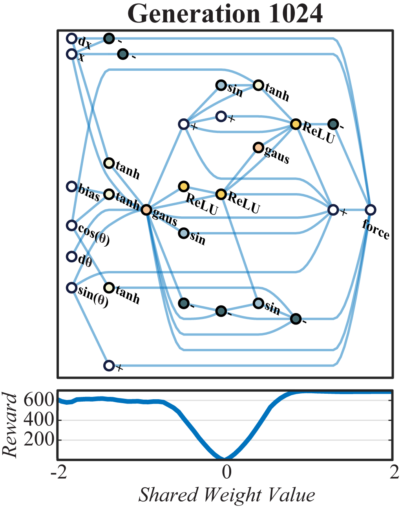
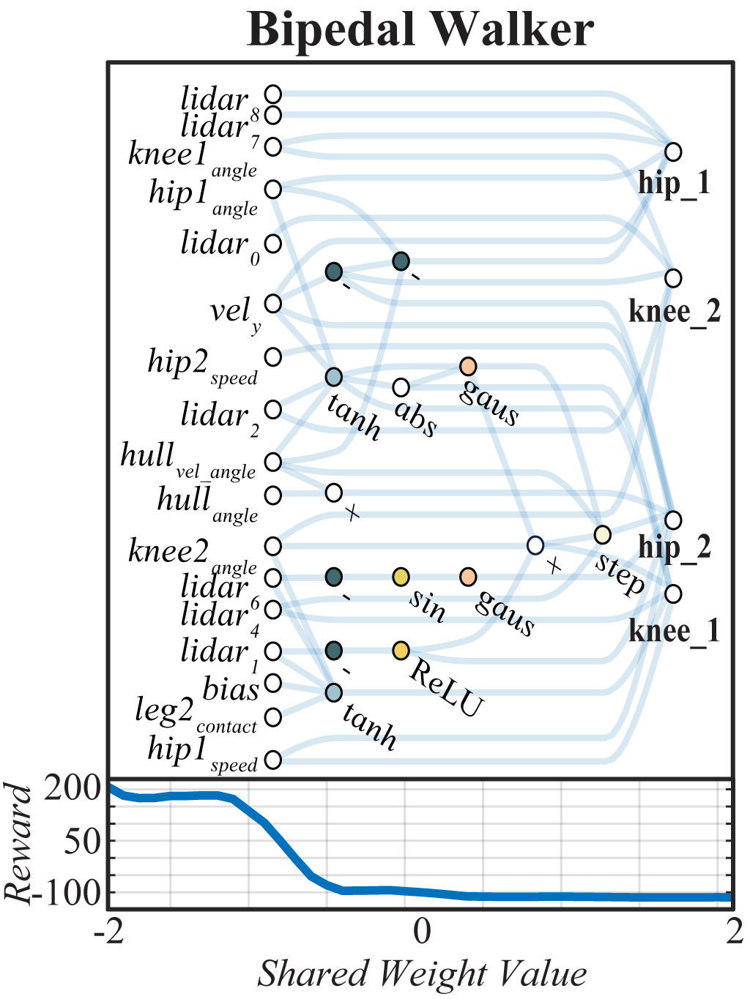
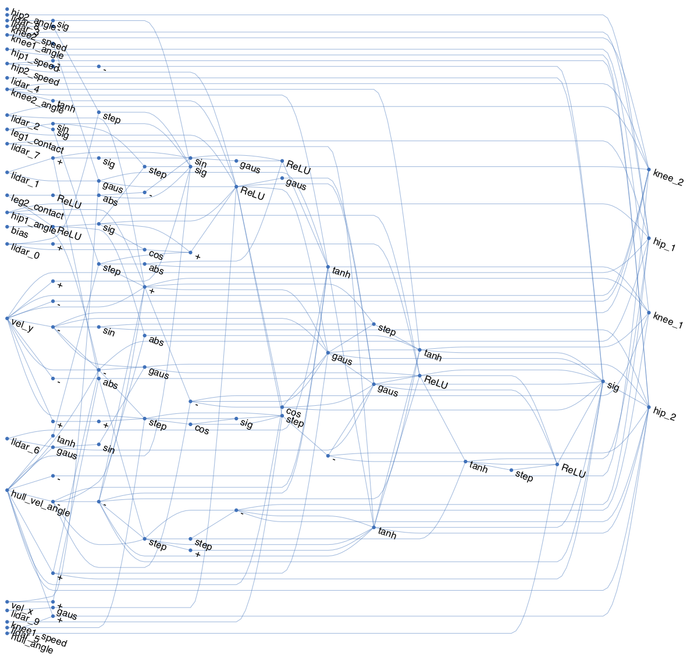
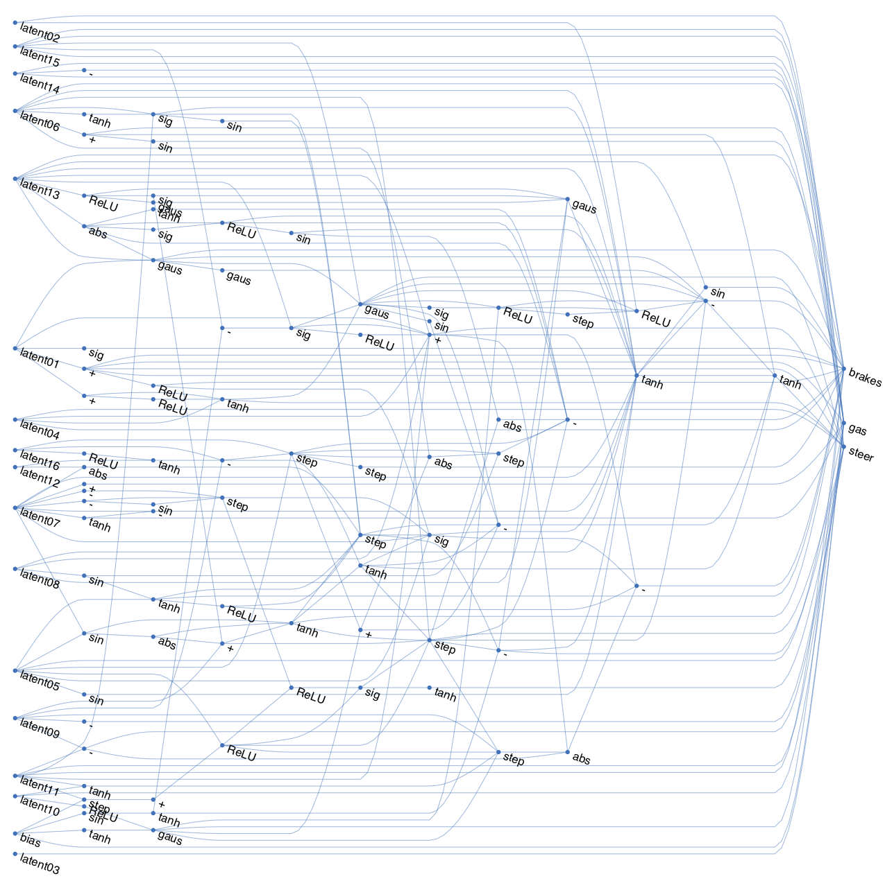

## Abstract 

Not all neural network architectures are created equal, some perform much better than others for certain tasks. But how important are the weight parameters of a neural network compared to its architecture? In this work, we question to what extent neural network architectures alone, without learning any weight parameters, can encode solutions for a given task. We propose a search method for neural network architectures that can already perform a task without any explicit weight training. To evaluate these networks, we populate the connections with a single shared weight parameter sampled from a uniform random distribution, and measure the expected performance. We demonstrate that our method can find minimal neural network architectures that can perform several reinforcement learning tasks without weight training. On supervised learning domain, we find network architectures that can achieve much higher than chance accuracy on MNIST using random weights.

______

## Supplementary Videos

Below are additional videos that accompany the paper. Please refer to Section 4, Experimental Results of the main text for additional information.

## Cartpole Swingup

<figcaption style="text-align: center;">Network and performance chart vs weight at Generation 8</i>.</figcaption>

<figcaption style="text-align: center;">Generation 8, weight set to -0.5</i>.</figcaption>

<figcaption style="text-align: center;">Generation 8, weight set to +1.5</i>.</figcaption>

<figcaption style="text-align: center;">Network and performance chart vs weight at Generation 32</i>.</figcaption>

<figcaption style="text-align: center;">Generation 32, weight set to -1.0</i>.</figcaption>

<figcaption style="text-align: center;">Generation 32, weight set to +1.5</i>.</figcaption>

<figcaption style="text-align: center;">Network and performance chart vs weight at Generation 128</i>.</figcaption>

<figcaption style="text-align: center;">Generation 128, weight set to -0.75</i>.</figcaption>

<figcaption style="text-align: center;">Generation 128, weight set to +2.0</i>.</figcaption>

<figcaption style="text-align: center;">Network and performance chart vs weight at Generation 1024 (champion network)</i>.</figcaption>

<figcaption style="text-align: center;">Generation 1024, weight set to -2.0</i>.</figcaption>

<figcaption style="text-align: center;">Generation 1024, weight set to +1.0</i>.</figcaption>

<video class="b-lazy" data-src="assets/finetuned/trained_swing.mp4" type="video/mp4" autoplay muted playsinline loop style="display: block; margin: auto; width: 100%;" ></video>
<figcaption style="text-align: center;">Finetuned weights of champion network.</figcaption>

## Bipedal Walker

<figcaption style="text-align: center;">Network and performance chart vs weight of Bipedal Walker agent as shown in Figure 1 of the main text.</i></figcaption>

<figcaption style="text-align: center;">The more complicated champion network for <i>BipedalWalker-v2</i></i> found in later generations.</figcaption>

<video class="b-lazy" data-src="assets/biped/trial_biped_-2.0.mp4" type="video/mp4" autoplay muted playsinline loop style="display: block; margin: auto; width: 100%;" ></video>
<figcaption style="text-align: center;">Weight set to -2.0</figcaption>

<video class="b-lazy" data-src="assets/biped/trial_biped_-1.5.mp4" type="video/mp4" autoplay muted playsinline loop style="display: block; margin: auto; width: 100%;" ></video>
<figcaption style="text-align: center;">Weight set to -1.5</figcaption>

<video class="b-lazy" data-src="assets/misc/trial_example_biped_-1.0.mp4" type="video/mp4" autoplay muted playsinline loop style="display: block; margin: auto; width: 100%;" ></video>
<figcaption style="text-align: center;">Weight set to -1.0</figcaption>

<video class="b-lazy" data-src="assets/biped/trial_biped_failures.mp4" type="video/mp4" autoplay muted playsinline loop style="display: block; margin: auto; width: 100%;" ></video>
<figcaption style="text-align: center;">Failure cases at other weight values.</figcaption>

<video class="b-lazy" data-src="assets/misc/trial_balancer.mp4" type="video/mp4" autoplay muted playsinline loop style="display: block; margin: auto; width: 100%;" ></video>
<figcaption style="text-align: center;">At some non-optimal weights (here, weight set to +1.14), it performs non trivial actions like balancing.</figcaption>

<video class="b-lazy" data-src="assets/finetuned/trained_biped.mp4" type="video/mp4" autoplay muted playsinline loop style="display: block; margin: auto; width: 100%;" ></video>
<figcaption style="text-align: center;">Finetuned weights of champion network.</figcaption>

<figcaption style="text-align: center;">WANN discovered if we allow connection between outputs.</figcaption>

<video class="b-lazy" data-src="assets/misc/trial_outConns_-1.0.mp4" type="video/mp4" autoplay muted playsinline loop style="display: block; margin: auto; width: 100%;" ></video>
<figcaption style="text-align: center;">Rollout of policy using above network, weight set to -1.0</figcaption>

## Car Racing from Pixels

<figcaption style="text-align: center;">Champion network for <i>CarRacing-v0</i></i>.</figcaption>

<figcaption style="text-align: center;">Mean Cumulative Reward vs Weight for champion network.</figcaption>

<video class="b-lazy" data-src="assets/carracing/trial_racer_-1.4.800px.mp4" type="video/mp4" autoplay muted playsinline loop style="display: block; margin: auto; width: 100%;" ></video>
<figcaption style="text-align: center;">Weight set to -1.4</figcaption>

<video class="b-lazy" data-src="assets/carracing/trial_racer_+1.0.800px.mp4" type="video/mp4" autoplay muted playsinline loop style="display: block; margin: auto; width: 100%;" ></video>
<figcaption style="text-align: center;">Weight set to +1.0</figcaption>

<video class="b-lazy" data-src="assets/finetuned/trained_racer.mp4" type="video/mp4" autoplay muted playsinline loop style="display: block; margin: auto; width: 100%;" ></video>
<figcaption style="text-align: center;">Finetuned weights of champion network.</figcaption>

